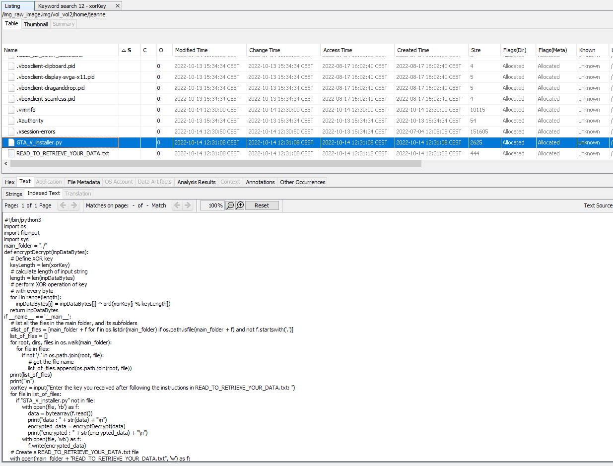
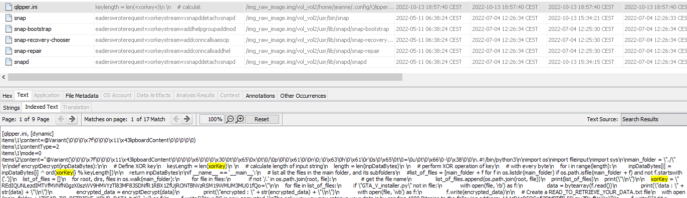
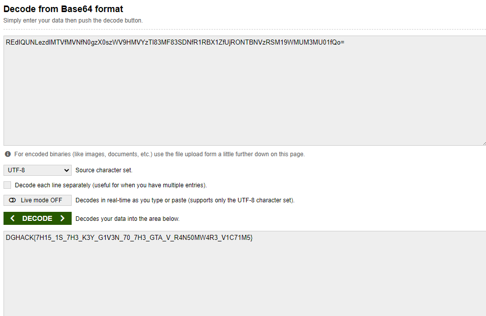

# pas un bon nom

> J'étais là tranquillou sur mon PC, m'voyez ? Je télécharge des films et tout, m'voyez ? Et alors il y a ce message étrange que je dois payer Dogecoin pour déchiffrer mes données. Je ne l'ai pas fait... donc maintenant mes données sont chiffrées :( Donc tiens, prends le disque dur, c'est pas comme si il était utile maintenant... Sauf si c'était possible de retrouver la clé utilisée par ce méchant hacker, m'voyez ? S'il te plaiiiit ? Tu serais adorable merci !

## Ma solution

Tout d'abord je cherche à consulter le contenu de mon disque dur, pour cela je veux l'ouvrir avec Autopsy.

Cependant pour l'ouvrir avec Autopsy, il doit être au format raw, j'utilise donc les fonctionnalités intégrée à VirtualBox pour le convertir au format raw comme décrit dans cette vidéo : https://www.youtube.com/watch?v=60Nv1zPVzjc

Voici avec quoi je me retrouve : 

Comme décrit dans l'énnoncé, la victime télécharge des torrents, je remarque alors un fichier qui retient mon attention : "GTA_V_installer.py"

En consultant le code, on voit que la clé de déchiffrement s'appelle xorKey, je cherche alors une string qui porte ce nom dans le disque dur à l'aide d'Autopsy

Je récupère alors ma variable xorKey qui ressemble à du texte encodé en base64, j'essaye alors de l'entrer dans un décodeur : 

Flag: `DGHACK{7H15_1S_7H3_K3Y_G1V3N_70_7H3_GTA_V_R4N50MW4R3_V1C71M5}
`
